# Proyecto Final - Estructuras de Datos

## Integrantes

* Viannys Tatiana Parra Caldas
* Integrante 2
* Integrante 3

---

# Sistema Hospital Universitario San Rafael

## Descripción

Sistema web desarrollado para la gestión académica y hospitalaria de estudiantes en prácticas profesionales dentro del Hospital Universitario San Rafael.

La aplicación permite administrar estudiantes, horarios, áreas hospitalarias, usuarios del sistema, cronogramas y reportes de horas de práctica.

---

# Tecnologías Utilizadas

* Java
* Spring Boot
* Maven
* Thymeleaf
* HTML5
* CSS3
* Bootstrap
* MySQL

---

# Funcionalidades Principales

* Inicio de sesión de usuarios
* Dashboard administrativo
* Gestión de estudiantes
* Registro de horarios
* Control de asistencia
* Gestión de áreas hospitalarias
* Administración de usuarios
* Cronograma mensual
* Reportes de horas

---

# Evidencias del Sistema

## Inicio de Sesión

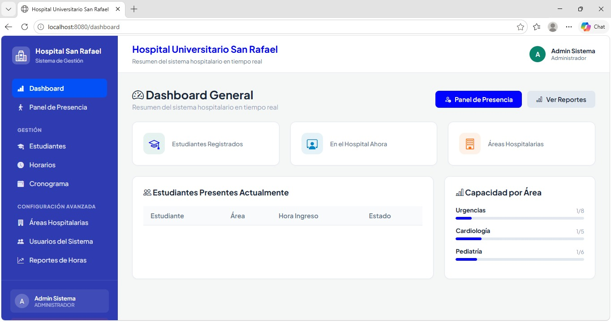

---

## Dashboard General

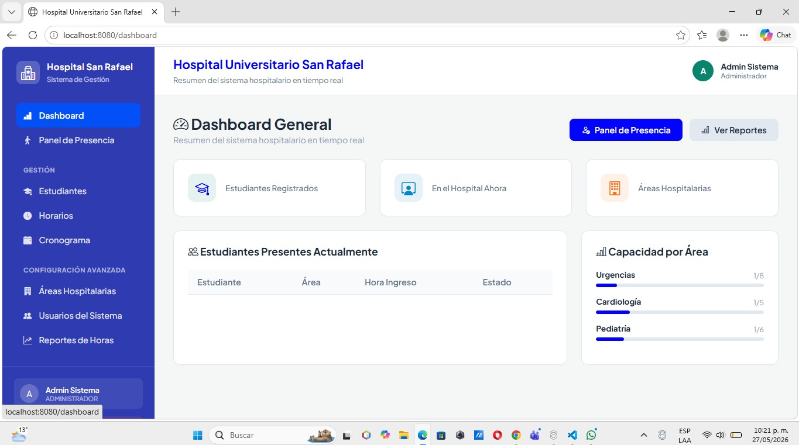

---

## Panel de Presencia

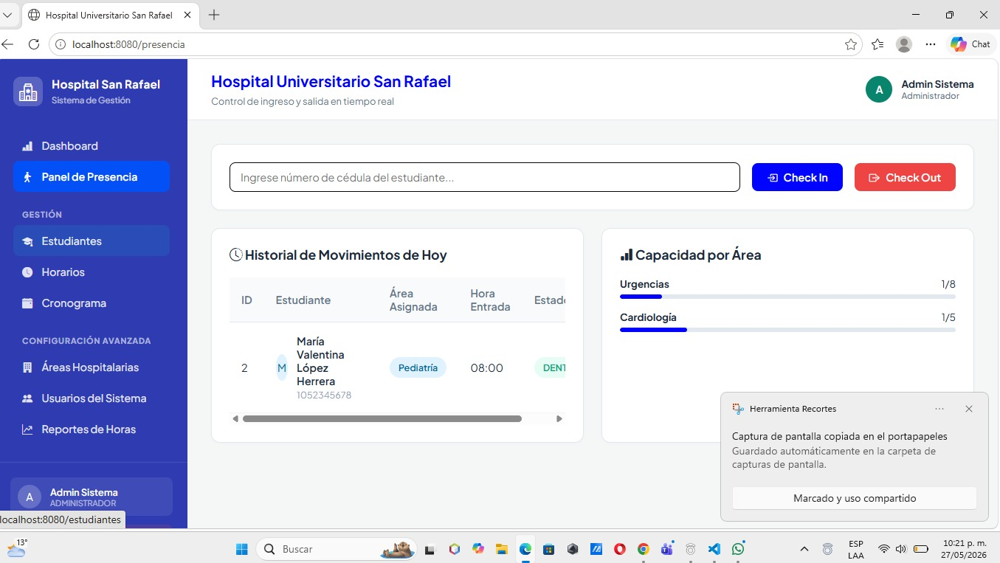

---

## Gestión de Estudiantes

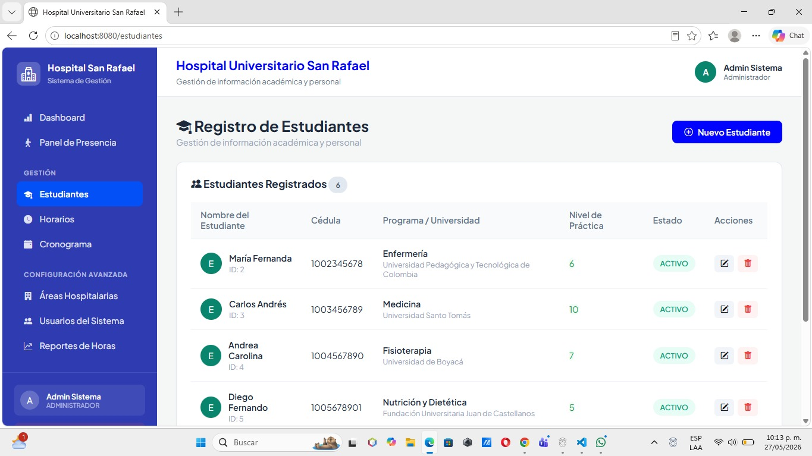

---

## Registro de Nuevo Estudiante

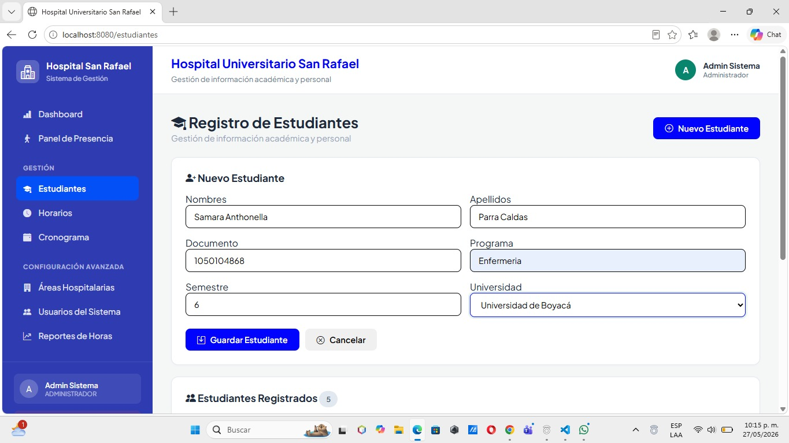

---

## Gestión de Horarios

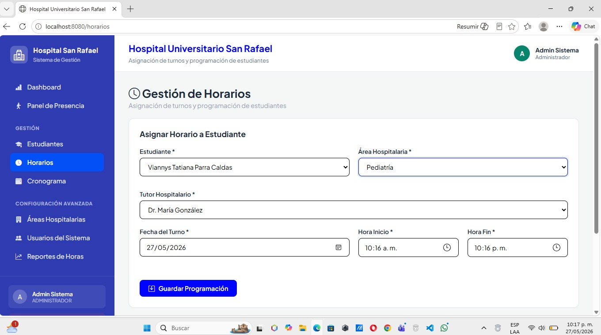

---

## Horarios Programados

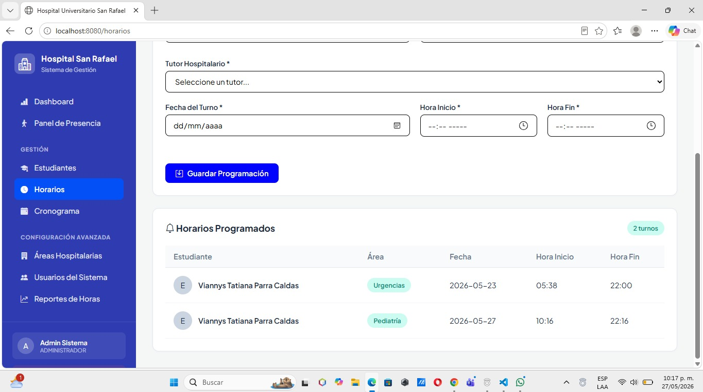

---

## Gestión de Áreas Hospitalarias

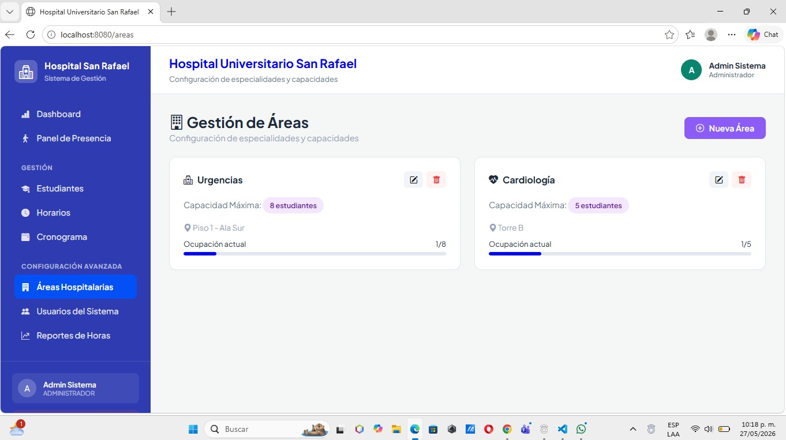

---

## Gestión de Usuarios

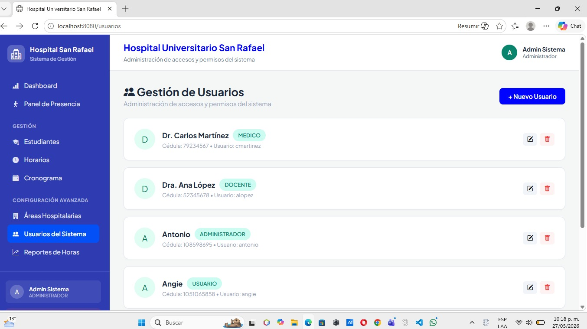

---

## Cronograma Mensual

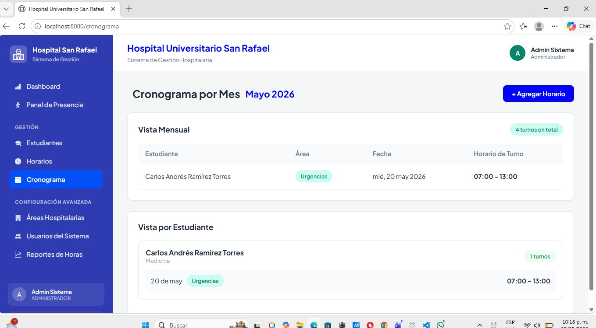

---

## Reportes de Horas

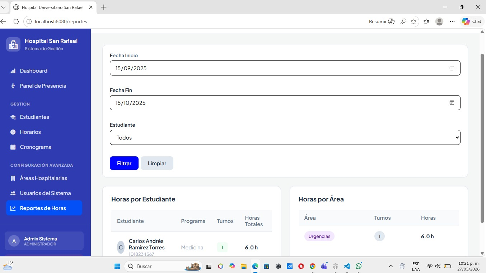

---

# Repositorio del Proyecto

Repositorio GitHub:
https://github.com/viannysparra93-sys/frontend
